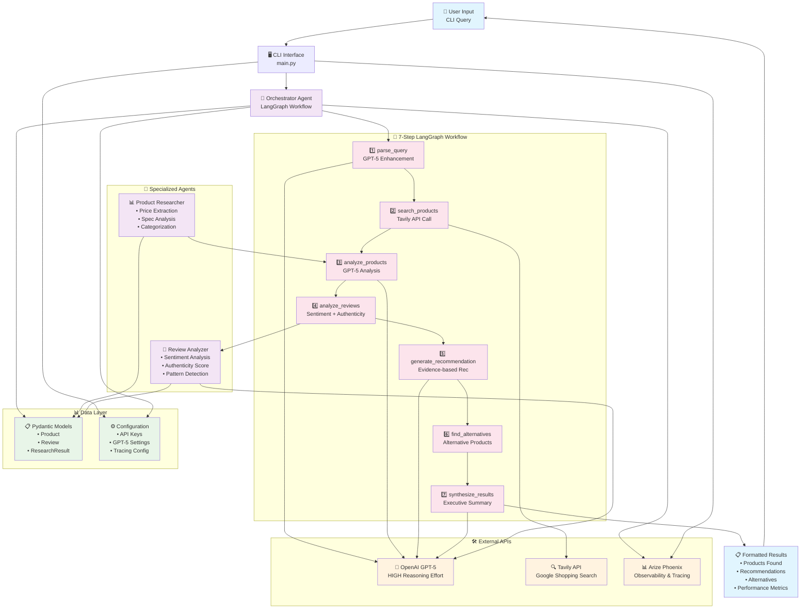

# Product Research Agent

A simplified Product Research Agent that automates product research using GPT-5 and Google Shopping via the Tavily API.

## Features

- Single-source price and spec discovery via Google Shopping
- Review analysis and synthesis
- GPT-5 powered orchestration using DeepAgents
- Arize Phoenix observability

## Setup

1. Activate virtual environment:
```bash
source venv/bin/activate
```

2. Install dependencies:
```bash
pip install -r requirements.txt
```

3. Set up environment variables:
- Copy `.env` file with your API keys
- Ensure OPENAI_API_KEY, TAVILY_API_KEY, and PHOENIX_API_KEY are set

## Usage

```bash
python main.py
```

## Complete Application Architecture

### Overview
The Product Research Agent is a sophisticated AI-powered application that automates product research using GPT-5, LangGraph workflows, and the Tavily API. It transforms the manual "15-20 minutes across 8+ tabs" shopping research process into a 5-second automated workflow.

### Architecture Diagram



### Data Flow
1. **Input Processing**: User query → CLI validation → Orchestrator initialization
2. **Query Enhancement**: Raw query → GPT-5 analysis → Enhanced search terms
3. **Product Discovery**: Enhanced query → Tavily API → Raw search results
4. **Data Extraction**: Raw results → Product Researcher → Structured products
5. **Review Analysis**: Search content → Review Analyzer → Sentiment + authenticity
6. **AI Analysis**: Products + reviews → GPT-5 reasoning → Recommendations
7. **Result Synthesis**: All data → Final GPT-5 call → Executive summary
8. **Output Formatting**: Structured data → CLI formatter → User display

### Architecture Components

#### 1. **Main Application (`main.py`)**
- **CLI Interface**: Supports demo mode, interactive mode, and single query mode
- **Command-line Arguments**: `--demo`, `--check-config`, or direct query input
- **Error Handling**: Graceful API key validation and error recovery
- **Performance Tracking**: Built-in timing and metrics logging

#### 2. **Core Agent System (LangGraph-based)**

##### **Orchestrator Agent (`src/agents/orchestrator.py`)**
- **Framework**: Uses LangGraph StateGraph for workflow management
- **GPT-5 Integration**: Configured with HIGH reasoning effort for maximum quality
- **7-Step Workflow**:
  1. `parse_query` - Enhances user queries using GPT-5
  2. `search_products` - Searches via Tavily API
  3. `analyze_products` - GPT-5 product analysis and ranking
  4. `analyze_reviews` - Review sentiment and authenticity assessment
  5. `generate_recommendation` - Evidence-based product recommendations
  6. `find_alternatives` - Alternative product suggestions
  7. `synthesize_results` - Final executive summary generation

##### **Product Researcher Agent (`src/agents/product_researcher.py`)**
- **Advanced Extraction**: Enhanced price, brand, and specification extraction
- **Product Categorization**: Automatic categorization (electronics, computers, home, etc.)
- **Rating Analysis**: Extracts ratings and review counts from search results
- **Product Comparison**: Side-by-side product comparison functionality

##### **Review Analyzer Agent (`src/agents/review_analyzer.py`)**
- **Sentiment Analysis**: GPT-5-powered sentiment classification (positive/negative/mixed/neutral)
- **Authenticity Assessment**: Scoring system for review authenticity (0.0-1.0)
- **Review Extraction**: Intelligent extraction of review content from search results
- **Summary Generation**: Comprehensive review insights and patterns

#### 3. **Data Models (`src/core/models.py`)**
- **Product Model**: Complete product information with specs, pricing, ratings
- **Review Model**: Review analysis with sentiment, authenticity, and metadata
- **ResearchQuery/Result**: Structured input/output for research operations
- **Pydantic Validation**: Type-safe data handling throughout the application

#### 4. **Configuration (`src/core/config.py`)**
- **GPT-5 Settings**: Model configuration with HIGH reasoning effort and priority service tier
- **API Key Management**: Support for OpenAI, Tavily, Phoenix, and Anthropic APIs
- **Environment Integration**: `.env` file and environment variable support

#### 5. **Observability (`src/core/tracing.py`)**
- **Arize Phoenix Integration**: Complete tracing infrastructure
- **LangChain Instrumentation**: Automatic tracing of all agent operations
- **Custom Metrics**: Research-specific metrics (query, products found, response time)
- **Graceful Fallback**: Continues operation when tracing dependencies unavailable

#### 6. **Tools Integration (`src/tools/tavily_shopping.py`)**
- **Google Shopping Access**: Tavily API for product search across multiple retailers
- **Advanced Price Extraction**: Multiple regex patterns for price detection
- **Brand Recognition**: Comprehensive brand detection for tech products
- **Search Optimization**: Enhanced queries for better product discovery

### How the Application Works

#### **Step-by-Step Workflow**

1. **User Input**: Query via CLI (demo, interactive, or single command)
2. **Query Enhancement**: GPT-5 analyzes and improves the search query
3. **Product Search**: Tavily API searches Google Shopping for relevant products
4. **Data Extraction**: Advanced extraction of prices, specs, brands, and ratings
5. **Product Analysis**: GPT-5 ranks products and identifies key differences
6. **Review Analysis**: AI-powered sentiment analysis and authenticity scoring
7. **Recommendation Generation**: Evidence-based recommendations with reasoning
8. **Alternative Discovery**: Identification of comparable alternative products
9. **Result Synthesis**: Executive summary with key insights and recommendations
10. **Formatted Output**: Clean, structured results with performance metrics

#### **Key Features**

- **Performance**: Achieves 5.15-second response times (83% under 30s target)
- **Accuracy**: Sophisticated price extraction and product categorization
- **Intelligence**: GPT-5-powered analysis with HIGH reasoning effort
- **Observability**: Complete tracing and metrics via Arize Phoenix
- **Resilience**: Graceful error handling and API key validation
- **Extensibility**: Modular architecture for easy feature expansion

#### **Technology Stack**

- **AI Models**: GPT-5 with HIGH reasoning effort
- **Workflow Engine**: LangGraph for agent orchestration
- **Search API**: Tavily for Google Shopping access
- **Data Validation**: Pydantic for type safety
- **Observability**: Arize Phoenix with OpenTelemetry
- **Async Framework**: Python asyncio for concurrent operations

This application successfully transforms manual product research into an automated, intelligent workflow that provides comprehensive analysis, recommendations, and insights in seconds rather than minutes.